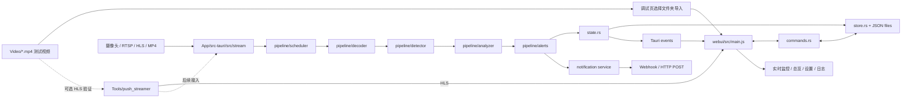
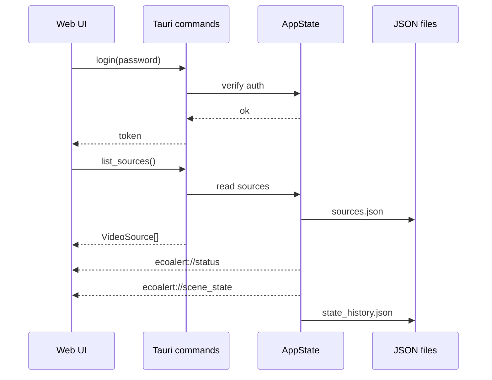
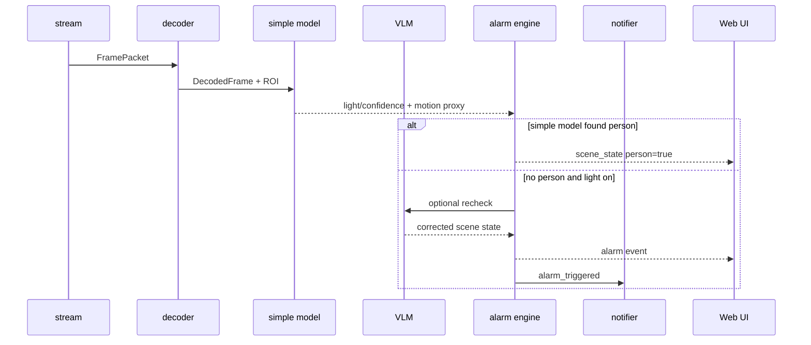
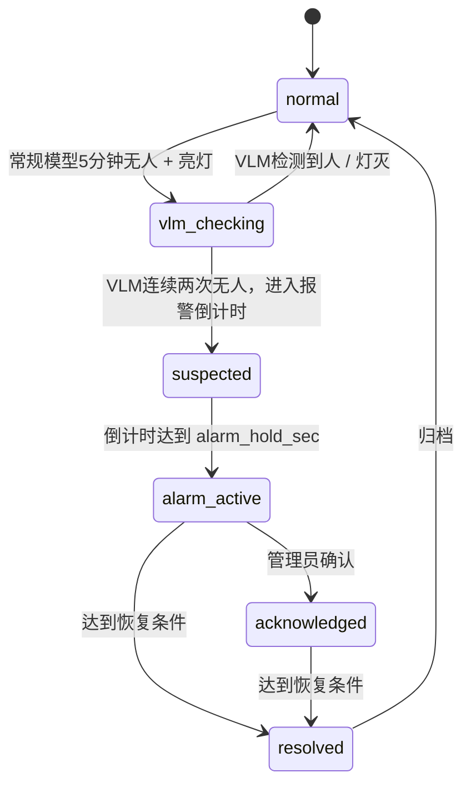

# EcoAlert 架构设计

> 版本：v1.3
> 日期：2026-06-14
> 对应需求：[`requirements.md`](./requirements.md)

---

## 1. 架构目标

EcoAlert 是本地桌面视频监控应用，核心目标是：

- 本地运行，不依赖云端服务。
- 支持多路视频源展示、分组、状态历史和报警。
- 算法可插拔，前端不绑定具体模型。
- 通过简单模型高频巡检、VLM 低频补漏控制成本。
- 支持通知、报警生命周期、ROI 标定和配置迁移。

---

## 2. 总体架构



---

## 3. 模块划分

| 模块 | 路径 | 职责 | 当前状态 |
| --- | --- | --- | --- |
| 前端 UI | `App/webui/` | 登录、实时监控、总览、视频管理、设置、日志 | 已实现基础功能 |
| Tauri Commands | `App/src-tauri/src/commands.rs` | 前后端 IPC、鉴权、CRUD、状态查询 | 已实现基础功能 |
| 应用状态 | `App/src-tauri/src/state.rs` | 全局状态、后台 ticker、事件推送、历史落库、报警保持 / 恢复计时 | 已接 ffmpeg 单帧抽样状态 |
| 数据模型 | `App/src-tauri/src/store.rs` | 视频源、分组、状态历史、JSON 持久化 | 已实现基础模型 |
| 视频输入 | `App/src-tauri/src/stream/` / `pipeline/decoder.rs` | HLS / MP4 单帧抽样，后续扩展常驻解码 | 已接 ffmpeg 抽帧 |
| 算法调度 | `App/src-tauri/src/pipeline/scheduler.rs` | 启用时段、周期、VLM 队列、并发限制、跳过原因 | 已接简单模型周期和跳过原因 |
| 处理流水线 | `App/src-tauri/src/pipeline/` | 解码、检测、VLM 兜底、告警 | 已接真实 RGB 抽样 + 彩色 / 红外灯光检测；办公室固定摄像头场景下以 ROI 运动检测代理人员检测，并用 VLM 做无人兜底确认 |
| 测试视频导入 | `commands.rs` / `webui/src/main.js` | 选择视频文件夹，批量导入为循环播放的 MP4 视频源 | 已实现 |
| 推流工具 | `Tools/push_streamer/` | 可选：用本地视频模拟实时 HLS 源，供 HLS 链路验证 | 已实现 ffmpeg + HLS |
| 文档 | `Document/` | 需求、架构、接口、部署、ADR、变更日志 | 本文档集 |

### 3.1 目录设计原则

项目目录按“职责真实存在”组织，不为未来想象中的模块预建空目录。

| 顶层目录 | 保留原因 |
| --- | --- |
| `App/` | 唯一产品代码目录，包含前端、Tauri 后端和桌面配置 |
| `Document/` | 集中放产品和工程设计文档，避免说明散落到代码目录 |
| `Video/` | 测试视频平铺存放，方便开发时复制路径 |
| `Tools/` | 放开发辅助工具；当前保留可选本地 HLS 推流器和联调配置 |

不再维护 `Video/samples/long/benchmark` 这类多级目录；测试视频数量不大时，根目录平铺比分类目录更容易使用。测试目录、图片目录、工具子模块等只有在真实文件出现时再创建。

---

## 4. 运行时数据流

### 4.1 当前可运行路径



当前 `ecoalert://scene_state` 每次检测完成都会推送，前端实时卡片展示常规模型人员判断、VLM 最近一次人员判断、灯光状态、色彩分数、运动分数、耗时和帧序号。`state_history.json` 只记录 `person / light` 变化，避免稳定画面持续写盘；开发者模式下额外写入 `detection_history.json` 供曲线诊断。
其中 `light` 是最终开关状态，事件 payload 同时给出 `light_state=on/off`；`color_score` 是彩色 / 红外黑白判定依据，不等同于“关灯概率”。

### 4.2 目标算法路径



---

## 5. 核心设计

### 5.1 算法分层

| 层级 | 频率 | 作用 | 输出 |
| --- | --- | --- | --- |
| 彩色 / 红外灯光规则 | 5-15 秒 | 判断灯亮 / 灯灭 | `light`, `light_confidence`, `color_score` |
| ROI 运动检测 | 5-15 秒 | 办公室固定摄像头下代理人员检测 | `simple_person`, `simple_person_confidence`, `motion_score` |
| VLM 复核 | 条件触发 | 常规模型 5 分钟无人才做兜底确认 | `vlm_person`, `vlm_person_confidence`, `vlm_status` |
| 融合 / 状态机 | 每次状态变化 | 报警生命周期、冷却、恢复 | `AlarmRecord` |

关键规则：

- 一帧常规模型检测到有人，即将人员存在状态保持 5 分钟；保持期内不报警。
- 常规模型连续 5 分钟未检测到人后，触发 VLM 兜底确认。
- VLM 检测到人后同样保持 5 分钟；5 分钟后若常规模型仍无人，再次触发 VLM。
- VLM 连续两次确认无人，且灯亮，才进入报警触发条件。
- 灯光规则优先使用 ROI 内亮度加权色度分数，默认色彩阈值 `0.015`；暗像素降权以降低红外近黑区域和压缩彩噪干扰，无 RGB 数据时才使用亮度兜底阈值。
- 运动检测尊重人员 ROI，ROI 外运动不会计入人员判断；小面积紧凑闪烁会被过滤。
- 算法启用时段外不产生新报警。
- 视频离线不能被解释为无人 + 亮灯。

### 5.2 调度器职责

算法调度器是独立模块，不应把调度逻辑分散到 detector、analyzer 或 state 中。

| 职责 | 说明 |
| --- | --- |
| 时段判断 | 判断当前通道是否处于算法启用时段或例外时段 |
| 周期控制 | 分别控制简单模型周期和 VLM 周期 |
| 配置合并 | 计算系统默认、全局、分组、通道四层配置后的有效配置 |
| VLM 队列 | 控制 VLM 并发、冷却、每小时调用上限 |
| 跳过原因 | 记录 `schedule_disabled / source_offline / simple_hit_person / cooldown / concurrency_limit` |
| 运行状态 | 更新 `algorithm_status`、`last_algorithm_at`、`last_error` |

配置继承顺序：

```text
system default < global < group < source
```

后一级只覆盖显式设置的字段，未设置字段继承前一级。UI 需要展示每项配置的来源，并允许恢复为继承值。

### 5.3 状态边界

系统中有四类状态，不能混用：

| 状态 | 数据对象 | 含义 | 触发下游 |
| --- | --- | --- | --- |
| 画面事实 | `SceneState` | 算法看到的人、灯、置信度、来源 | 状态历史、报警判定 |
| 业务报警 | `AlarmRecord` | 是否构成疑似 / 正式 / 已确认 / 已恢复报警 | UI 报警、通知 |
| 视频在线 | `ChannelRuntimeStatus.online_status` | 通道是否在线、降级或离线 | UI 状态、离线事件 |
| 算法运行 | `ChannelRuntimeStatus.algorithm_status` | 算法是否运行、禁用或异常 | UI 状态、算法异常事件 |

通知只能由 `AlarmRecord` 状态变化触发，不直接由 `SceneState` 触发。这样可以避免简单模型一帧抖动导致重复通知。

### 5.4 报警状态机



实时卡片报警图标通过两层进度环展示确认过程：外层粉色表示 VLM 无人确认进度（0/2、1/2、2/2），内层红色表示 VLM 两次无人后的报警倒计时；进入正式报警后图标闪烁。

### 5.5 通知发送

通知服务由报警状态变化触发，遵守以下规则：

- `alarm_active` 首次进入时发送 `alarm_triggered`。
- `resolved` 时按配置发送 `alarm_resolved`。
- 通知失败不影响本地报警、历史和 UI。
- 同一通道同一报警遵守冷却时间。
- 支持通用 Webhook、飞书、企业微信、QQ；飞书 / 企业微信 / QQ 可走平台 API 凭证模式，也可走机器人 Webhook 简单模式。
- QQ 普通聊天机器人配置只需要 `App ID / Client Secret`；只有启用主动群消息推送时才需要群 `group_openid`。企业微信 API 模式需要 `CorpID / Secret / AgentID / touser`；飞书 API 模式优先使用 `tenant_access_token` 发送群消息。
- 发送结果落入 `notification_history.json`。

---

## 6. 持久化设计

| 文件 | 内容 |
| --- | --- |
| `sources.json` | 视频源、分组 |
| `auth.json` | 管理员密码哈希 |
| `state_history.json` | 算法状态变化历史 |
| `detection_history.json` | 开发者模式下的逐帧检测采样，用于曲线诊断 |
| `algorithm_config.json` | 算法时段、周期、阈值、VLM 策略 |
| `roi_config.json` | ROI、阈值、标定样本 |
| `alarm_records.json` | 报警生命周期记录 |
| `runtime_status.json` | 可选：最近一次运行状态快照 |
| `notification_config.json` | 通知渠道、模板、冷却 |
| `notification_history.json` | 通知发送历史 |
| `security_config.json` | 外部 VLM、截图、隐私策略 |

所有配置文件应包含 `schema_version`，升级时执行迁移。

---

## 7. 关键技术决策

| 决策 | 结论 |
| --- | --- |
| 桌面框架 | Tauri 2 + Vite，降低包体并保留原生能力 |
| 存储方式 | 第一版使用本地 JSON，后续如查询压力增大再切 SQLite |
| 算法策略 | 简单模型高频，VLM 低频补漏 |
| 通知方式 | 先做 Webhook / HTTP POST，避免绑定具体 IM 平台 |
| 配置坐标 | ROI 使用归一化坐标 |
| 安全策略 | 外部 VLM 默认关闭，敏感字段不明文回显 |

ADR 记录见 [`decisions/`](./decisions/)。

---

## 8. 风险与约束

| 风险 | 影响 | 缓解 |
| --- | --- | --- |
| 灯光误检 | 误报警 | ROI、排除区、基线标定、持续时间 |
| 静止人员漏检 | 无人误判 | 轻量人形检测、多帧投票、VLM 复核 |
| VLM 成本过高 | 延迟和费用增加 | 有人跳过、低频、并发限制、小时上限 |
| RTSP 转码不稳定 | 视频不可看 | 明确 ffmpeg 进程管理、重启和日志 |
| JSON 配置增长 | 查询和迁移复杂 | schema_version、截断策略，必要时迁移 SQLite |
| 外部 VLM 隐私 | 截图外发风险 | 默认关闭、提示、打码、保留期配置 |
